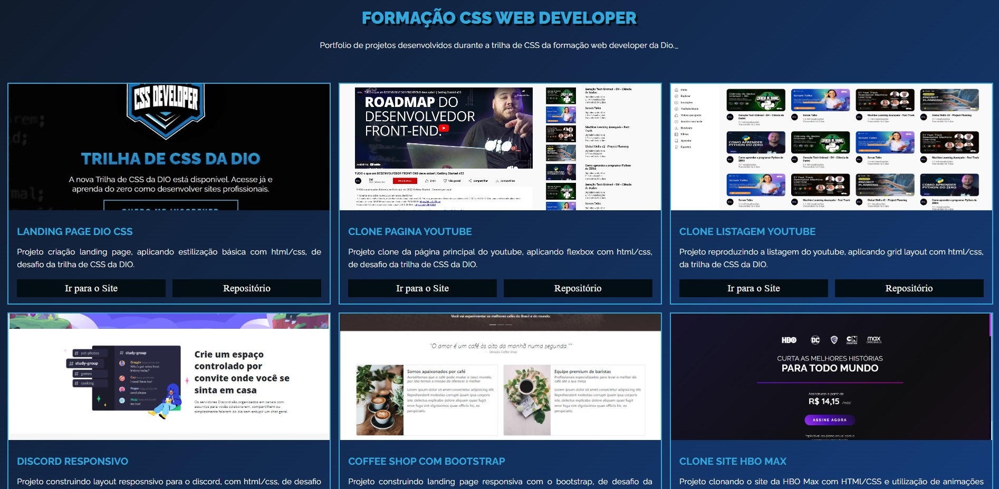

<h1>📌 <b>Formação CSS Web Developer</b></h1>

Este repositório de conteúdos da trilha da DIO  CSS Web Developer.

 

## 📚 **Descrição**
O Bootcamp consiste em 3 módulos principais, que são:
- Primeiros Passos com CSS;
- Trabalhando com Layout no CSS;
- Refinando os estilos CSS das nossas páginas;

A Formação possui 6 projetos práticos com CSS aplicando técnicas com flexbox, grid-layouts, animações e manipulação de pseudo elementos, classes e utilização do framework Bootstrap.

Para mais informações detalhadas dos módulos, o conteúdo está todos descrito nos readmes das respectivas pastas de cada módulo apresentado.

 

## 📎 **Sumário**
- ⭐ Projetos
- 📂 Temas abordados
- 🏆 Desafio
- 💻 Demonstração
- 🙋🏻‍♂️ Autor

 

## ⭐ **Features**
- Landing page DIO
- Clone do youtube com Flexbox
- Listagem do youtube com grid layout
- Site do Discord responsivo
- Coffee Shop com Bootstrap
- Clone HBO Max

 

## 📂 **Temas abordados**

Recursos CSS presentes nos projetos:

- Fundamentos do CSS
- Grid Layout
- Flexbox
- Responsividade
- Pseudo-elementos
- Pseudo-classes
- Transformações 2D e 3D
- Transições e animações
- Tratamento de campos inválidos no formulário
- Bootstrap

 

## 💻 **Demonstração**
Você pode acessar todos os projetos realizados <a href="https://brunooliveira16.github.io/Formacao-CSS-Web-Developer-DIO/" target="_blank">Clicando aqui</a>.

 

## 🏆 **Desafio**
Implementar os 6 projetos da trilha com as especificações e features exigidas.

  

 

## 🙋🏻‍♂️ **Autor**
Bruno Oliveira
