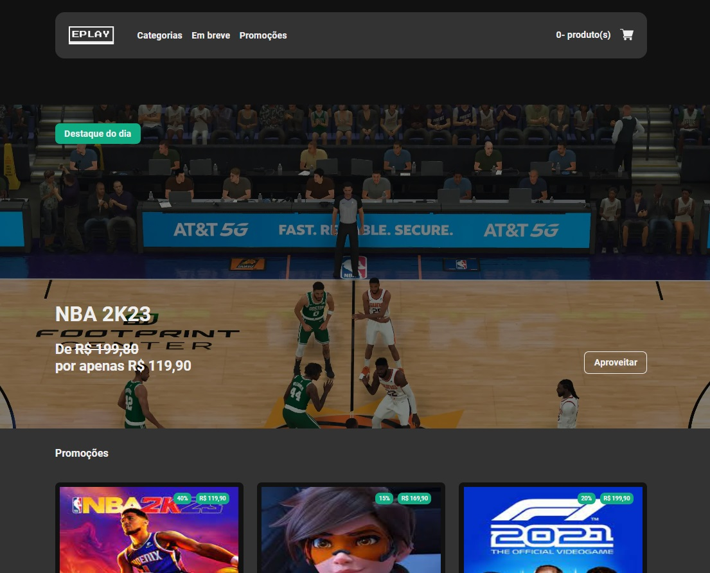

# 🏆 ePlay ecommerce

## ✔️ Tecnologias Utilizadas

 

## 📎 Sumario

- 📌 Resumo do Projeto
- 🛠️ Como executar o projeto
- ⭐ Desafio do Projeto
- 📂 Temas abordados
- 🙋🏻‍♂️ Autor
- 💻 Licença

 

## 📌 Resumo do Projeto
Este projeto é um desafio do curso engenheiro front-end da EBAC, cujo objetivo é reproduzir o layout disponibilizado no figma e todas as funcionalidades e requisitos que o desafio pede. As tecnologias e forma como serão construidas fica a cargo do desenvolvedor. Para este projeto foi utilizado React + TypeScript + Redux + Styled-components.

 

## 🛠️ Como executar o projeto
Para executar este projeto localmente em sua máquina, siga estas etapas:

- Certifique-se de ter o Node.js instalado em sua máquina.

- Clone este repositório em sua máquina local usando o comando ``git clone``.

- Instale as dependências do projeto executando ``npm install`` no diretório do projeto.

- Execute o comando ``npm start`` para rodar o projeto.

 

## ⭐ Desafio do Projeto
### 1º Etapa
- Utilizar como base o layout disponível no link do [Figma](https://www.figma.com/file/FiFpwvwwHX0rCbrXatjMg4/EPLAY?type=design&node-id=01&mode=design&t=tSWXw13ByJBj3hnN-0);
- Criar um novo projeto React;
- Utilizar como biblioteca o Styled Component para estilização;
- Utilizar como biblioteca o React Router para a navegação entre páginas;
- Criar um novo repositório para o projeto;
- Subir as alterações no repositório;
- Criar um projeto na Vercel;

 

## 📂 Temas abordados
- ``TypeScript``: Este projeto utiliza TypeScript, uma extensão tipada de JavaScript, para trazer um nível adicional de segurança e previsibilidade ao código. O TypeScript permite a detecção precoce de erros e fornece autocompletar melhorado no editor de código, tornando o desenvolvimento mais eficiente e menos propenso a erros.

- ``React``: O React é usado neste projeto para construir a interface do usuário. O React permite a criação de componentes reutilizáveis, tornando o código mais limpo e fácil de manter. Além disso, o React facilita a criação de interfaces de usuário interativas e dinâmicas.

- ``Redux``: Redux é uma biblioteca JavaScript de código aberto para gerenciar o estado do aplicativo. É mais comumente usado com bibliotecas associadas como React ou Angular para construir interfaces de usuário. Redux é usado neste projeto para gerenciar o estado do aplicativo de uma maneira previsível. Com o Redux, o estado do aplicativo é armazenado em um único objeto, facilitando o rastreamento de alterações ao longo do tempo e a depuração de problemas. Além disso, o Redux permite que você escreva lógica de negócios complexa em um local centralizado, em vez de espalhá-la por vários componentes.

- ``Styled Components``: Styled Components é uma biblioteca para estilizar componentes React. Neste projeto, Styled Components é usado para escrever CSS em JavaScript, permitindo que os estilos sejam dinâmicos e baseados em props. Isso também ajuda a manter os estilos encapsulados no componente, evitando conflitos de estilo e tornando o código mais limpo.

 

## 🙋🏻‍♂️ Autor

| [ Bruno Oliveira](https://github.com/BrunoOliveira16) |
| :---: |
