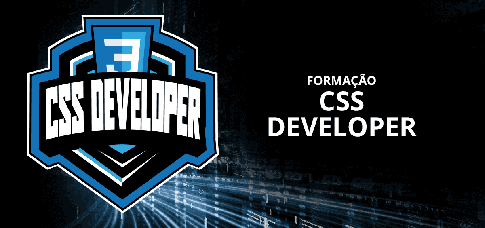

# Trilha CSS - Dio.me

## 📝 Módulo 03 - Refinando os estilos CSS das nossas páginas

# 📚 Descrição
- Pseudo elementos e Pseudo classes;
- Transições e animações;
- Boas práticas e convenções no CSS;
- Iniciando com seu primeiro framework em CSS: Bootstrap;
- Clonando o site da HBO Max com animações em HTML e CSS;

# ✍ Conteúdo
## 1- Pseudo elementos e Pseudo classes
### 1.1- Pseudo-elementos
- Apresentação
- First-letter
- First-line
- Backdrop
- Marker
- Place-holder
- Selection
- File-selector-button
- Before e after

### 1.2- Pseudo-classes
- Hover
- Active
- Focus
- Target
- Enable e Disable
- Link e Visited
- Place-holder-shown
- Checked e Indeterminate
- Valid e Invalid, in-range e out-ofrange
- Required e optional
- Autofill
- Root
- nth-child e nth-of-type
- first-of-type e last-of-type
- nth-last-child e nth-last-of-type
- only-child
- only-of-type
- empty
- is
- where
- not
- has

## 2- Transições e animações
### 2.1- Transformações 2D
- apresentação
- translate()
- rotate()
- rotateX() e rotateY()
- scale()
- skew()
- matrix()

### 2.2- Transformações 3D
- Perspectiva
- Rotacionando e movendo elementos no eixo Z
- Escalando elementos de forma tridimensional
- Transform-origin
- transform-style
- Matrix3d
- backface-visibility

### 2.3- Animações
- Transições
- exemplo prático - transicões e pseudo-elementos
- iniciando com animações
- definindo atraso e número de interações de uma animação
- direção de reprodução e curva de velocidade da animação
- propriedade animation-fill-mode
- pausando a animação e shorthand animation
- exemplo prático de animação 1
- exemplo prático de animação 2
- exemplo prático de animação 3
- exemplo prático de animação 4
- exemplo prático de animação 5
## 3- Boas práticas e convenções no CSS
### 3.1- Hierarquias e Especificidade
- Apresentação
- Hierarquia do efeito em casacata
- Especificidade
- !important
- Herança

### 3.2- Compatibilidade entre navegadores
- Motores de Renderizição
- Navegadores que não suportam recursos modernos
- Prefixo no CSS

### 3.3- Organizando os estilos CSS
- Definindo variáveis
- BEM (Block, Element, Modifier)
- SMACSS (Scalable and Modular Architecture for CSS)
- OOCSS (Object Oriented CSS)
## 4- Iniciando com seu primeiro framework em CSS: Bootstrap
- em desenvolvimento...
## 5- Clonando o site da HBO Max com animações em HTML e CSS
- em desenvolvimento...

# 💻 Dicas/Links Úteis
 
**Artigos/Fórum:** você pode compartilhar conteúdos técnicos através de Artigos (visíveis globalmente na plataforma da DIO). Por outro lado, você também pode compartilhar suas conquistas e dúvidas usando os Fóruns (que são específicos para cada experiência educacional na DIO, como um Bootcamp por exemplo);

**Rooms:** caso você esteja inscrito(a) em uma experiência educacional na DIO (como um Bootcamp, por exemplo) você terá acesso ao Rooms. O Rooms é uma ferramenta de bate-papo em tempo real onde todos os inscritos podem interagir, compartilhando dúvidas e dicas (que podem conter imagens e snippets de código-fonte);

**Pesquise na Web:** pode parecer óbvio, mas é importante frisar a importância das engines de busca no dia-a-dia de um profissional de TI. Caso não encontre o que procura dentro da DIO, pesquise sobre o assunto (conceito, dúvida, erro etc) na Internet (dê um Google), pois na maioria das vezes você será levado à páginas incríveis como o **StackOverflow** que salvarão o seu dia 😎
